# ⚖️ WITI Field (NOUR) - Digital Infrastructure for Institutional Bailiffs
🔗 [Live Case Study](https://sanadidari.com/witi/nour) | [WITI Ecosystem](https://sanadidari.com/witi)

**WITI Field** (codename: **NOUR**) is the specialized professional mobile ecosystem developed for the **Regional Council of Bailiffs** (Court of Appeal of Tetouan, Morocco). 

Currently in live field-testing, it bridges the gap between official judicial missions and modern high-trust digital documentation.

---

## 🏗️ Engineering Architecture & State Management

**WITI Field** is built with a **Feature-Driven Architecture** (FDA) and **Clean Architecture** principles, prioritizing high reliability and auditable code.

- **State Management**: **Riverpod** with **Code Generation** (`riverpod_generator`) for a precise, typed, and reactive state.
- **Dependency Injection**: Modular provider-based DI, enabling seamless mocking and unit testing of business logic.
- **Storage Strategy**: Local-first caching with **SQLite/Isar** for offline field durability, synced with **Supabase Real-time** via **Row-Level Security (RLS)**.
- **Hardware Integration**: Custom camera flows, GPS anti-spoofing, and **Google ML Kit Document Scanner** for high-integrity capture.

### 📁 Project Structure (lib/)
- `/features`: Domain-specific logic (Missions, Identity, Acts, Notifications).
- `/core`: Shared infrastructure, themes, and cross-cutting utilities.
- `/services`: Supabase listeners, Location handlers, and OCR connectors.
- `/providers`: High-level state managers and data flow orchestrators.

---

## 🔒 Institutional Security & Integrity
- **Field Authentication**: Deep integration with **WITI Governance** for authenticated mission assignment.
- **Evidence Verification**: Real-time integration with **WITI Certify (QRPRUF)** protocols for cryptographic proof of presence.

### 🏗️ Architectural Overview
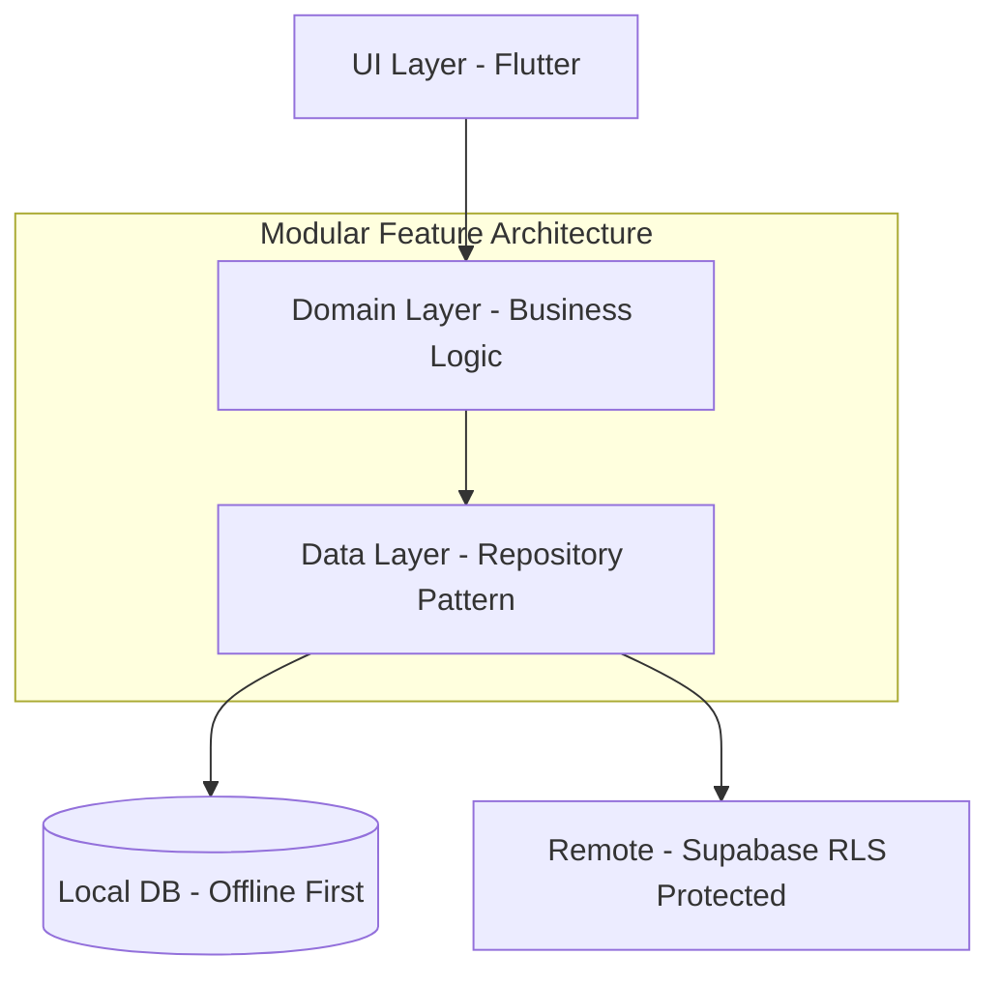

## Business Problem

Field-based legal and institutional operations often depend on manual coordination, phone calls, paper forms and fragmented evidence collection.

This creates several operational risks:

* weak traceability of field missions;
* inconsistent identity verification;
* difficulty proving location and execution time;
* delayed synchronization between field agents and back-office teams;
* lack of reliable mobile access to institutional data;
* limited visibility for administrators supervising distributed operations.

NOUR Mobile addresses this by providing a secure Flutter-based field operations app connected to the broader WITI ecosystem, combining identity capture, GPS mission tracking, offline-first workflows, Supabase synchronization and mobile access to institutional records.

---

## My Role

I designed and developed NOUR Mobile as a field operations application for legal and institutional users.

My work included:

* building the Flutter/Dart mobile application;
* structuring the app with a feature-driven architecture;
* integrating Supabase authentication, database and storage services;
* implementing offline-first mission workflows;
* integrating GPS-based mission tracking;
* implementing ML Kit-based CIN/document scanning;
* designing secure mobile access connected to the Governance Platform;
* preparing the app as the field/mobile layer of the WITI ecosystem.

---

## Security & Field Integrity Model

NOUR Mobile is designed for field environments where identity, location and mission traceability are important.

The application includes:

* authenticated mobile access;
* Supabase-backed user and mission synchronization;
* document/CIN capture workflows;
* GPS-based field mission tracking;
* offline-first data handling;
* controlled synchronization when connectivity is restored;
* separation between field mobile workflows and the institutional back-office;
* portfolio-safe public repository with production secrets and private operational data excluded.

---

## 📱 App Screenshots

> Live field deployment — Regional Council of Bailiffs, Court of Appeal of Tetouan, Morocco.

### Dashboard & Navigation
| Dark Mode | Light Mode | News & Activity |
|-----------|------------|-----------------|
| 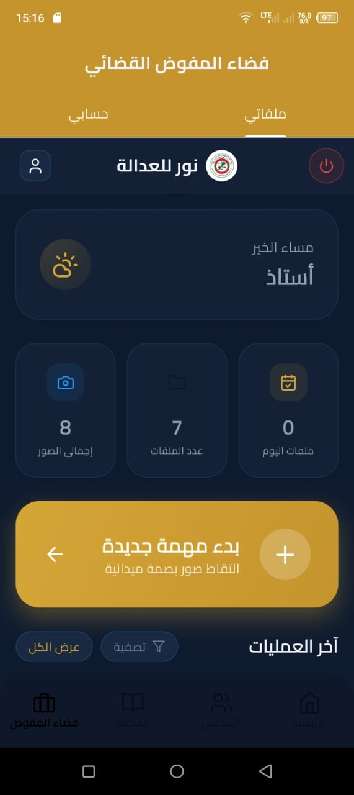 | 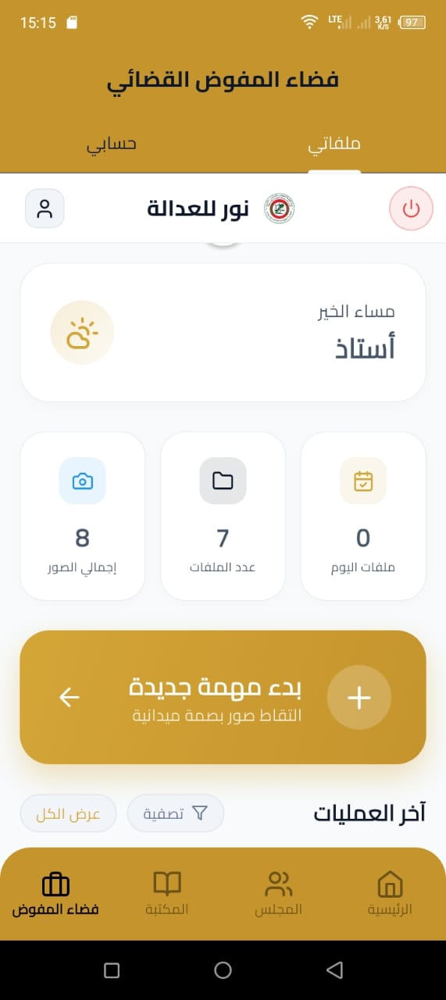 | 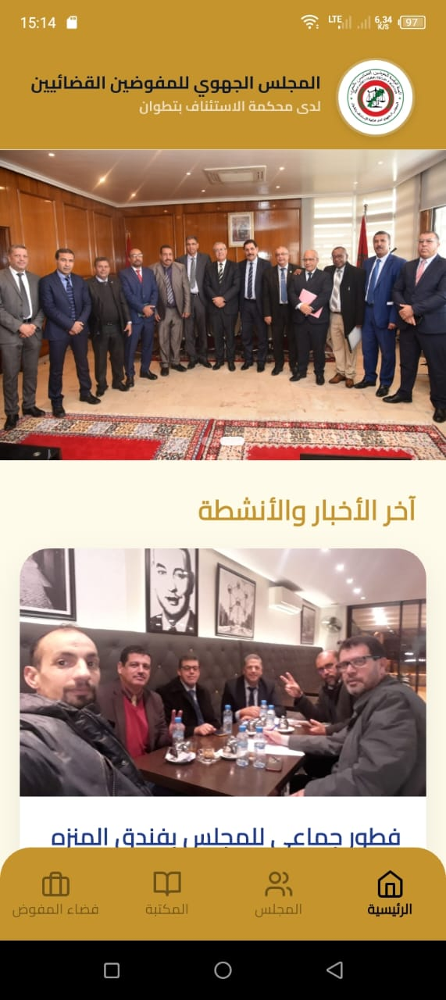 |

### Mission Workflow
| Intervention Form | Subject & Reference | GPS Proof |
|-------------------|---------------------|-----------|
| 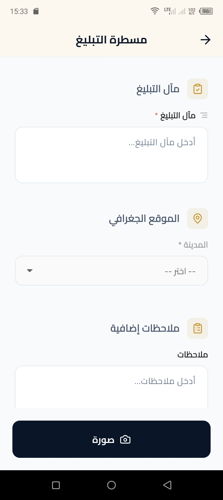 | 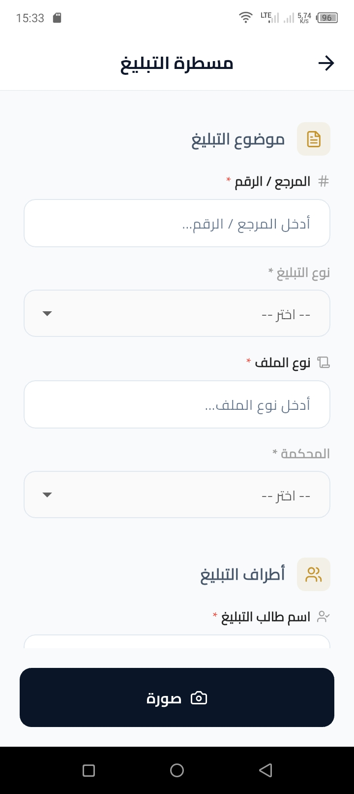 | 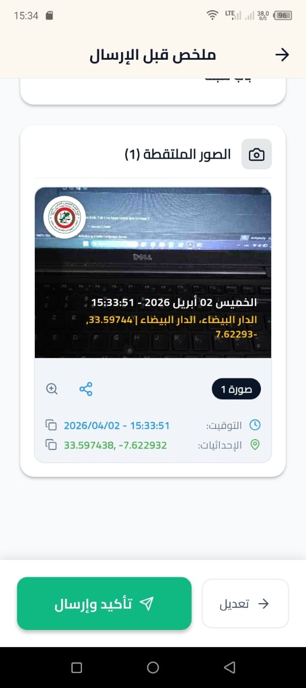 |

### Institutional Data
| Bailiff Directory | Regional Council | Legal Library |
|-------------------|------------------|---------------|
| 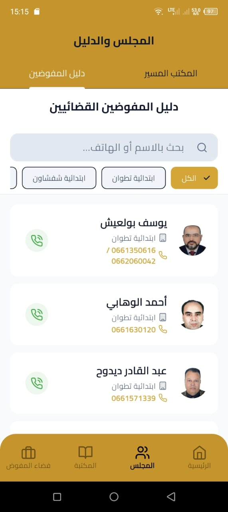 | 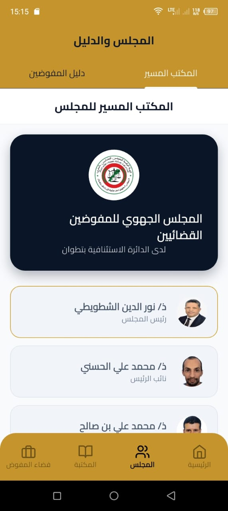 |  |

### Profile & Settings
| Dark Mode | Light Mode |
|-----------|------------|
| 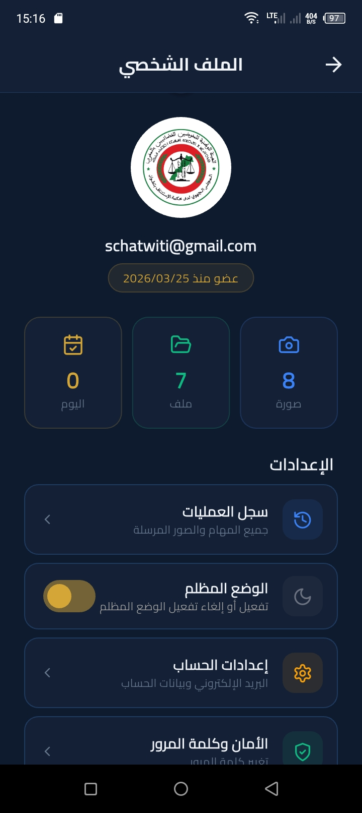 | 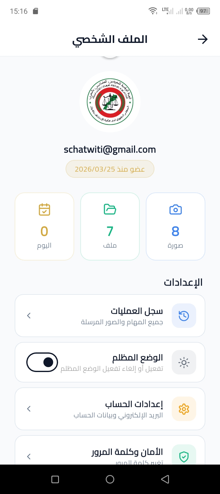 |

---

## 🚀 Getting Started (Developers)

### Prerequisites
- [Flutter SDK](https://docs.flutter.dev/get-started/install) (Stable)
- [Dart VM](https://dart.dev/get-started/dart-sdk)
- [Supabase CLI](https://supabase.com/docs/guides/cli)

### Installation
1. Clone the repository:
   ```bash
   git clone https://github.com/SamirChatwiti/nour-mobile.git
   cd nour
   ```
2. Install dependencies:
   ```bash
   flutter pub get
   ```
3. Generate code (Riverpod & Freezed):
   ```bash
   dart run build_runner build --delete-conflicting-outputs
   ```
4. Run the app:
   ```bash
   flutter run
   ```

---

## 🧪 Testing & CI/CD Status
- **Automated Testing**: Unit tests for domain logic located in `test/`.
- **CI/CD Pipeline**: Configured via **GitHub Actions** for automated static analysis (Lints) and test verification.

---

## 📜 License
Part of the **WITI Ecosystem**. License: **MIT License**.

---
*Developed by @sanadidari - Senior Full-Stack Engineer | Founder of Sanadidari SARL*

